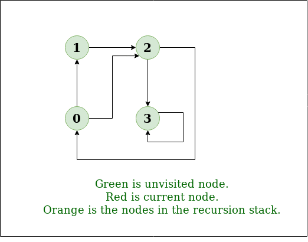

# DFS Notes and Concepts

<br/>

## Explanation:

In this example we are looking at the following graph and its adjacent vertices:


These are the outputs and inputs:
```
Input: n = 4, e = 6 
2 -> 0, 0 -> 2, 1 -> 2, 0 -> 1, 3 -> 3, 1 -> 3 
Output: DFS from vertex 2 : 2 0 1 3 
```

In our implementation we are visiting each node and its children, marking each current node as visited, then ouputting
each node as we iterate through the graph component. Note this would need to be done for each graph if this was a graph with multiple components. 

[GeeksforGeeks](https://www.geeksforgeeks.org/depth-first-search-or-dfs-for-a-graph/)