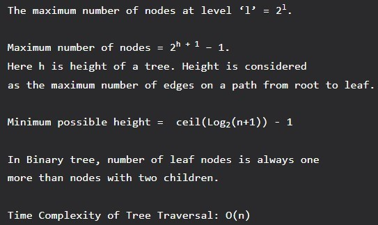

# DataStructuresNotes

### Brief Introduction: 

Comprehensive Notes on all things related to Data Structures 

 

## Arrays:

The size of an array must be provided before storing data.

Example: For example, let us say, we want to store marks of all students in a class, we can use an array to store them. This helps in reducing the use of a number of variables as we dont need to create a separate variable for marks of every subject. All marks can be accessed by simply traversing the array. 

 

## Linked Lists:

A linked list is a linear data structure (like arrays) where each element is a separate object. Each element (that is node) of a list is comprised of two items: the data and a reference to the next node. 

Types of Linked List : 
1. Singly Linked List: In this type of linked list, every node stores address or reference of the next node in the list and the last node has the next address or reference as NULL. For example 1->2->3->4->NULL 

2. Doubly Linked List: In this type of Linked list, there are two references associated with each node, One of the reference points to the next node and one to the previous node. The advantage of this data structure is that we can traverse in both directions and for deletion, we dont need to have explicit access to the previous node. Eg. NULL<-1<->2<->3->NULL 

3. Circular Linked List: Circular linked list is a linked list where all nodes are connected to form a circle. There is no NULL at the end. A circular linked list can be a singly circular linked list or a doubly circular linked list. The advantage of this data structure is that any node can be made as starting node. This is useful in the implementation of the circular queues in the linked list. Eg. 1->2->3->1 [The next pointer of the last node is pointing to the first]  

Example: Consider the previous example where we made an array of marks of students. Now if a new subject is added to the course, its marks are also to be added to the array of marks. But the size of the array was fixed and it is already full so it can not add any new element. If we make an array of a size lot more than the number of subjects it is possible that most of the array will remain empty. We reduce the space wastage Linked List is formed which adds a node only when a new element is introduced. Insertions and deletions also become easier with a linked list. 
One big drawback of a linked list is, random access is not allowed. With arrays, we can access ith element in O(1) time. In the linked list, it takes O(i) time. 

 

## Stacks:

A stack or LIFO (last in, first out) is an abstract data type that serves as a collection of elements, with two principal operations: push, which adds an element to the collection, and pop, which removes the last element that was added. In stack both the operations of push and pop take place at the same end that is top of the stack. It can be implemented by using both array and linked list.  

Example: Stacks are used for maintaining function calls (the last called function must finish execution first), we can always remove recursion with the help of stacks. Stacks are also used in cases where we have to reverse a word, check for balanced parenthesis, and in editors where the word you typed the last is the first to be removed when you use undo operation. Similarly, to implement back functionality in web browsers. 

 

## Queues:

A queue or FIFO (first in, first out) is an abstract data type that serves as a collection of elements, with two principal operations: enqueue, the process of adding an element to the collection. (The element is added from the rear side) and dequeue the process of removing the first element that was added. (The element is removed from the front side). It can be implemented by using both array and linked list. 

Example: Queue as the name says is the data structure built according to the queues of a bus stop or train where the person who is standing in the front of the queue(standing for the longest time) is the first one to get the ticket. So any situation where resources are shared among multiple users and served on a first come first serve basis. Examples include CPU scheduling, Disk Scheduling. Another application of queue is when data is transferred asynchronously (data not necessarily received at the same rate as sent) between two processes. Examples include IO Buffers, pipes, file IO, etc. 

Circular Queue The advantage of this data structure is that it reduces wastage of space in case of array implementation, As the insertion of the (n+1),’th element is done at the 0’th index if it is empty. 

 

## Binary Tree:

Unlike Arrays, Linked Lists, Stack, and queues, which are linear data structures, trees are hierarchical data structures. 
A binary tree is a tree data structure in which each node has at most two children, which are referred to as the left child and the right child. It is implemented mainly using Links. 

Binary Tree Representation: A tree is represented by a pointer to the topmost node in the tree. If the tree is empty, then the value of the root is NULL. A Binary Tree node contains the following parts. 
1. Data 
2. Pointer to left child 
3. Pointer to the right child 

A Binary Tree can be traversed in two ways: 
Depth First Traversal: Inorder (Left-Root-Right), Preorder (Root-Left-Right), and Postorder (Left-Right-Root) 
Breadth-First Traversal: Level Order Traversal 

Binary Tree Properties

Examples: One reason to use binary trees or trees, in general, is for the things that form a hierarchy. They are useful in File structures where each file is located in a particular directory and there is a specific hierarchy associated with files and directories. Another example where Trees are useful is storing hierarchical objects like JavaScript Document Object Model considers HTML page as a tree with nesting of tags as parent-child relations. 

Binary Search Tree 
In Binary Search Tree is a Binary Tree with the following additional properties: 
1. The left subtree of a node contains only nodes with keys less than the node’s key. 
2. The right subtree of a node contains only nodes with keys greater than the node’s key. 
3. The left and right subtree each must also be a binary search tree. 

Time Complexity

BST provides moderate access/search (quicker than Linked List and slower than arrays). 
BST provides moderate insertion/deletion (quicker than Arrays and slower than Linked Lists). 

Examples: Its main use is in search applications where data is constantly entering/leaving and data needs to be printed in sorted order. For example in implementation in E-commerce websites where a new product is added or product goes out of stock and all products are listed in sorted order. 

Binary Heap 
A Binary Heap is a Binary Tree with the following properties. 
1) It’s a complete tree (All levels are completely filled except possibly the last level and the last level has all keys as left as possible). This property of Binary Heap makes them suitable to be stored in an array. 
2) A Binary Heap is either Min Heap or Max Heap. In a Min Binary Heap, the key at the root must be minimum among all keys present in Binary Heap. The same property must be recursively true for all nodes in Binary Tree. Max Binary Heap is similar to Min Heap. It is mainly implemented using an array. 

Example: Used in implementing efficient priority queues, which in turn are used for scheduling processes in operating systems. Priority Queues are also used in Dijkstra’s and Prim’s graph algorithms. 
The Heap data structure can be used to efficiently find the k smallest (or largest) elements in an array, merging k sorted arrays, a median of a stream, etc. 
Heap is a special data structure and it cannot be used for searching a particular element. 

HashingHash Function: A function that converts a given big input key to a small practical integer value. The mapped integer value is used as an index in the hash table. A good hash function should have the following properties 
1) Efficiently computable. 
2) Should uniformly distribute the keys (Each table position equally likely for each key) 

Hash Table: An array that stores pointers to records corresponding to a given phone number. An entry in a hash table is NIL if no existing phone number has a hash function value equal to the index for the entry. 

Collision Handling: Since a hash function gets us a small number for a key which is a big integer or string, there is the possibility that two keys result in the same value. The situation where a newly inserted key maps to an already occupied slot in the hash table is called collision and must be handled using some collision handling technique. Following are the ways to handle collisions: 

Chaining: The idea is to make each cell of the hash table point to a linked list of records that have the same hash function value. Chaining is simple but requires additional memory outside the table. 
Open Addressing: In open addressing, all elements are stored in the hash table itself. Each table entry contains either a record or NIL. When searching for an element, we one by one examine table slots until the desired element is found or it is clear that the element is not in the table. 

Hashing seems better than BST for all the operations. But in hashing, elements are unordered and in BST elements are stored in an ordered manner. Also, BST is easy to implement but hash functions can sometimes be very complex to generate. In BST, we can also efficiently find floor and ceil of values. 

Example: Hashing can be used to remove duplicates from a set of elements. Can also be used to find the frequency of all items. For example, in web browsers, we can check visited URLs using hashing. In firewalls, we can use hashing to detect spam. We need to hash IP addresses. Hashing can be used in any situation where want search() insert() and delete() in O(1) time. 

This article is contributed by Abhiraj Smit. Please write comments if you find anything incorrect, or you want to share more information about the topic discussed above.