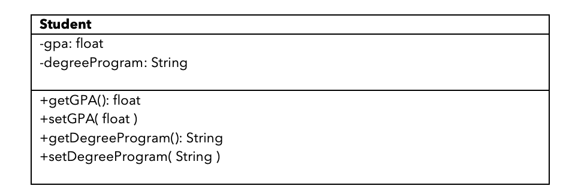
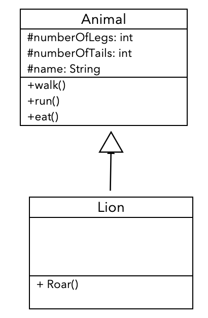
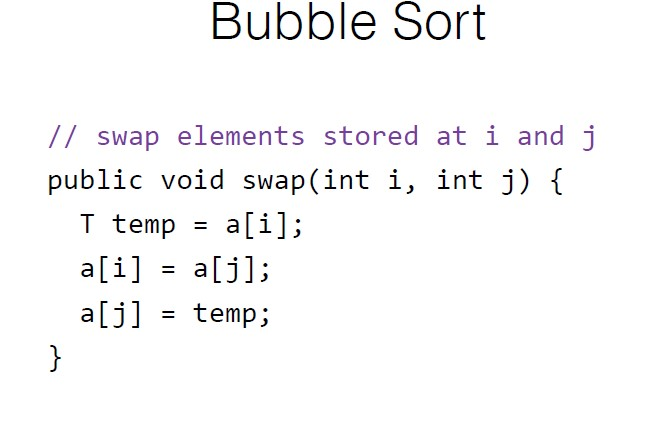

# DataStructuresNotes


### Brief Introduction: 

Comprehensive Notes on all things related to Data Structures 

<br/>

## Interview Prep w/Some Solutions:

Allscripts Interview Question:
Given a list of n integers combine the lists and return one full sorted list at the end. He specified he was looking for a solution using a data structure, I tried to do it by adding every element in two loops to combine them into one array and then sort this. 

This is my solution after thinking about the problem more. I think there is a better way to solve this, but this solution uses a priority queue to push the elements from each list of list integers. Then once we create the queue (I noticed this was unsorted) we have to remove from it and add to an array to get it to sort. The reasoning is explained in this [stackoverflow solution](https://stackoverflow.com/questions/20923615/sorting-integers-by-a-priority-queue), but essentially when converting the queue to an array the elements are in no particular order. So this way adding it to the array each element at a time is how we return a sorted list.

Also note this solution can be better since its O(n^2 + n)

```
package com.practice;

import java.util.ArrayList;
import java.util.Arrays;
import java.util.List;
import java.util.PriorityQueue;

public class Main {
    // We pass to this method the following values for each list
    list1 = [2, 5, 6, 8, 12]
    list2 = [7, 8, 13, 14, 19, 20, 26, 30]
    list3 = [1, 2, 3, 14]
    listoflists = [list1, list2, list3]

    public static List<Integer> mergeSortedLists(List<List<Integer>> listoflists) {
        List<Integer> combinedList = new ArrayList();

        // Loop through each list
        // For each list get the inner lists ints and push to the priority queue
        // Run a while loop until queue is empty and pop to combinedList

        PriorityQueue<Integer> queue = new PriorityQueue<>();


        for(int i=0; i<listoflists.size(); i++) {
            List<Integer> inputList = new ArrayList<>();
            inputList = listoflists.get(i);
            int count = 0;
            while(count != inputList.size()) {
                int inputVal = inputList.get(count);
                queue.add(inputVal);
                count++;
            }
        }

        Integer[] arr = new Integer[queue.size()];
        for (int i = 0; i < arr.length; i++) {
            arr[i] = queue.remove();
        }


        combinedList = Arrays.asList(arr);
        System.out.println(combinedList.toString());

        return combinedList;
    }
}
```


Common Interview Topics to Know by Heart:


Note: A lot of these problems can be solved with Breadth First Search and Hash Tables (hence why they are highlighted)
* Also should know how to write a breadth first search from scratch

Take a Look at the:
Resource-White-Boarding-Resources-Guide.pdf -> Contains free mock interviews sights that can be used to practive live technical interviews.

Some Useful Blog Posts to Handle Technical Interview Pressure (especially for questions you don't know)

[Top 8 Common Mistakes and Why](https://blog.pramp.com/top-8-mistakes-in-technical-interviews-according-to-data-27d2572bda1f)

[How to get Unstuck During Technical Interview](https://blog.pramp.com/how-to-get-unstuck-in-technical-interviews-93d4632ef996)

[Need Some Coding Projects to Learn (From Coding Bootcamps)](https://www.google.com/search?q=ideas+for+programming+projects&oq=ideas+for+program&aqs=chrome.0.0j69i57j0l4.5016j0j7&sourceid=chrome&ie=UTF-8)

Common System Design Topics to Know:


* Spend some time asking questions about the scope of the requirements of the system
* Take a look at [github on System Design](https://github.com/checkcheckzz/system-design-interview) contains everything you need to learn how to answer these questions
* There is a [blog](http://blog.gainlo.co/index.php/category/system-design-interview-questions/) as well containing specific interview questions such as how to build a key value store, garabage collector, or web crawler and how you would build them

[Guide to Take Home Challenges](https://www.freecodecamp.org/news/the-essential-guide-to-take-home-coding-challenges-a0e746220dd7)


Breadth First Search and Depth First Search:
- Used for graphs

DFS:
* Goes deep to each child before going broad to each neighbor
* Done recursively using helper such as hasPath() to check each node, node by node until we find the one we are looking for
* Need an isVisited flag to identify we have found the node to avoid being stuck in a infinite loop

[Take a look at the implementation](https://github.com/NithinMahesh1/DataStructuresNotes/tree/development/Practice%20Technical%20DS%26A/DFS%20Basic%20Implementation)

BFS:
* Goes broad to each neighbor before going deep
* Iterative, need to use a queue e.g. queue a,b
* Add all the children to the queue, then pull out the first element to the queue, check if it has a path, and if it is not the final element add all of its children to the queue

<!-- TODO add in the implementation for BFS  -->

Spring Common Questions:
SBEVision
* What is dependency injection in Spring Frameowork?
    - Spring container "injects" objects into other objects or "dependencies"
    - Ensures loose coupling between classes 
        * Loose Coupling:
            - Classes are independent of each other
            - The only knowledge between the two clases is what the other class has exposed through its interfaces
    - This is responsible for injecting dependencies through either Constructor or Setter methods
    - IOC (Inversion of Control) - emphasizes keeping the Java classes independent of each other and the container frees them from object creation and maintenance.
    - IOC is how we create loose coupling of components
        - An example of this is if you are driving your car to work (tight coupling) vs having a cab take you where someone is driving you to work (loose coupling) since we are changing the control to the cab driver.
        * So for example if we have two classes:
        * Tight Coupling
        ```
        public class A
        {
            B b;

            public A()
            {
                b = new B();
            }

            public void Task1() {
                // do something here..
                b.SomeMethod();
                // do something here..
            }

        }

        public class B {

            public void SomeMethod() { 
                //doing something..
            }
        }
        ```

        * After Inversion of control
        ```
        public class A
        {
            B b;

            public A()
            {
                b = Factory.GetObjectOfB ();
            }

            public void Task1() {
                // do something here..
                b.SomeMethod();
                // do something here..
            }
        }

        public class Factory
        {
            public static B GetObjectOfB() 
            {
                return new B();
            }
        }
        ```


* What is loose coupling:
    - Imagine you have created two classes, A and B, in your program. Class A is called volume, and class B evaluates the volume of a cylinder. If you change class A volume, then you are not forced to change class B. This is called loose coupling in Java. When class A requires changes in class B, then you have tight coupling.


<br/>

## Basics of OOP:

The main ideas behind Java Object-Oriented Programming include abstraction, encapsulation, and polymorphism. 

* Abstraction: Using simple things to represent complexity. We all know how to turn on a TV, but we don't need to know how it works in order to enjoy it. In Java, abstraction means simple things like objects, classes, and variables represent more complex underlying code and data. This is important because it lets you avoid repeating the same work multiple times.
* Encapsulation: The practice of keeping fields within a class private, then providing access to those fields via public methods. Encapsulation is a protective barrier that keeps data and code safe within the class itself. We can the reuse objects like code components or variables without allowing open access to the data system-wide.
* Inheritance: A special feature of OOP in Java, inheritance lets programmers create new classes that share some of the attributes of existing classes. Using inheritance lets us build on previous work without reinventing the wheel.
* Polymorphism: Allows programmers to use the same word in Java to mean different things in different contexts. One form of polymorphism is method overloading. Thats when code itself implies different meanings. The other form is method overriding. Thats when values of the supplied variables imply different meanings.
    - Polymorphism in Java works by using a reference to a parent class to affect an object in the child class. We might create a class called “horse” by extending the “animal” class. That class might also implement the “professional racing” class. The “horse” class is “polymorphic,” since it inherits attributes of both the “animal” and “professional racing” class.
    - Method overriding: the child class can use the OOP polymorphism concept to override the method of its parents class. That allows the programmer to use one method in different ways depending on whether its invoked by an object or the parent class or an object of the child class.
    - Method Overloading: a single method may perform different functions depending on the context in which it is called. This means that a single method name might work in different ways depending on what arguments are passed to it.

Example of method overloading:
```
class Adder{  
static int add(int a,int b){return a+b;}  
static int add(int a,int b,int c){return a+b+c;}  
}  
class TestOverloading1{  
public static void main(String[] args){  
System.out.println(Adder.add(11,11));  
System.out.println(Adder.add(11,11,11));  
}}  
```

Example of method overriding:
```
class Human{
   //Overridden method
   public void eat()
   {
      System.out.println("Human is eating");
   }
}
class Boy extends Human{
   //Overriding method
   public void eat(){
      System.out.println("Boy is eating");
   }
   public static void main( String args[]) {
      Boy obj = new Boy();
      //This will call the child class version of eat()
      obj.eat();
   }
}
```

What is static?
- Static is mainly used for memory management
- Used to share the same variable or method of a given class 
- Users can apply this with variables, methods, blocks, nested classes
- Belongs to the class then the instance of the class
- Used as constant variable (as the name suggests) or a method that is the same for every instance of a class

What is abstract?
- Indicates that the class cannot be instantiated
- Object cannot be created

When a member is declared static, it can be accessed before any objects of its class are created, and without reference to any object. For example, in the below java program, we are accessing static method m1() without creating any object of the Test class. 
```
// Java program to demonstrate that a static member
// can be accessed before instantiating a class

class Test
{
	// static method
	static void m1()
	{
		System.out.println("from m1");
	}

	public static void main(String[] args)
	{
		// calling m1 without creating
		// any object of class Test
		m1();
	}
}

Outputs: from m1
```


What is Super?
- Refers to the SuperClass (to access methods from the super class in other objects)
- For example SuperClass Animals contains a sounds method, we can extend this class with a sub class Dog, which then can be instatied as an object and both methods from both objects are called:
```
class Animal { // Superclass (parent)
  public void animalSound() {
    System.out.println("The animal makes a sound");
  }
}

class Dog extends Animal { // Subclass (child)
  public void animalSound() {
    super.animalSound(); // Call the superclass method
    System.out.println("The dog says: bow wow");
  }
}

public class Main {
  public static void main(String args[]) {
    Animal myDog = new Dog(); // Create a Dog object
    myDog.animalSound(); // Call the method on the Dog object
  }
}
```


What languages are managed and unmanaged?
- With memory collecion a managed language deals with removing the memory from the heap after the program executes
- Managed languages remove this automatically (most modern languages do this)
- Unmanaged languages require the coder to remove the memory from the heap (such as C and C++)


What is the garbage collector in a language?
- A garbage collector is for automatic memory management
- It removes the used memory from the heap once the program has run

What is the JVM?
- JVM stands for Java Virtual Machine
- Java programs compile to byte code that can be run on a JVM 
- This is used for garbage collection
- You need it to run the byte code produced by a java compiler but do not specifically have one installed
- It is possible to bundle a JVM with a Java program so when the user downloads your program they have java installed along with it
- This has the major benefit of having a Java app able to run on any operating system that can run a JVM

JRE
- The environment that the JVM runs on
- Contains JVM, class libraries and other files excluding the development tools such as compiler and debugger
- Meaning you can run code on the JRE but can't develop or compile on it

JDK
- A superset of JRE
- Contains everything that the JRE has along with development tools such as compiler, debugger, etc.


What are collections?
- Framework that provides architecture to store and manipulate a group of objects
- Java collections can perform operations such as searching, sorting, insertion, manipulation, and deletion
- Contains classes:
    * ArrayList, Vector, LinkedList, PriorityQueue, Hashset, LinkedHashSet, TreeSet
- Contains Interfaces:
    * Set, List, Queue, Dequeue
- List<E> list = new List<E>(); is not a collection but an interface


What is the output file from a garbage collector?
- In Java this would be .java files 
- In C# this would be clr files (common language runtime)

Some notes on Big O notation:

Space Complexity:

O(1):
- The space required by an algorithm does not grow with the inpt or size of the data on which we are using the algorithm. 
- If you have a traversal algorithm for traversing the list which allocate a single pointer to do so, the traversal algorithms is considered to be of O(1) space complexity.
- Additionally, let's say that traversal algorithm needs not 1 but 1000 pointers, the space complexity is still considered to be O(1).
- However, if let's say for some reason the algorithm needs to allocate 'N' pointers when traversing a list of size N, i.e., it needs to allocate 3 pointers for traversing a list of 3 elements, 10 pointers for a list of 10 elements, 1000 pointers for a list of 1000 elements and so on, then the algorithm is considered to have a space complexity of O(N). This is true even when 'N' is very small, eg., N=1.
[Citation](https://stackoverflow.com/questions/43260889/what-is-o1-space-complexity#:~:text=o(1)%20space%20complexity%20means,%E2%80%93%20Rodrigo%20Gonzalez)

<br/>

## Occurences in Java I did not know about:

When getting the char at an index in String you can convert it to an int using the following :
* int digit = string.charAt(index) - '0';
* You need to add the "- '0'"

We can also get Character.isDigit() :
* Does the obvious of checking whether there is a digit at that index

Integer.MAX_VALUE :
* This will check if the integer is within 32 bit range integer range in memory


Pre-Increment VS Post-Increment:

Post-Increment:
```
// initialize i
int i = 0;
System.out.println("Post-Increment");

// i values is incremented to 1 after returning
// current value i.e; 0
System.out.println(i++);

Output: 0
```


Pre-Increment:
```
// initialized to 0
int j = 0;
System.out.println("Pre-Increment");

// j is incremented to 1 and then it's value is
// returned
System.out.println(++j);

Output: 1
```


<br/>

## System Architecture and Design:

One common approach for designing a larger enterprise web application is using an MVC, DDD (domain driven design) and a database-independent data layer:
* Presentation Layer: Model - View - Controller (calls from the UI to the business logic layer should be placed inside the presentation controller)
* Business Layer: Application Logic
* Data Layer: Data Repositories - Data Access Layer

Note that we should place the business logic in the controller. Since the contoller handles the calls to a specific resource, queries the data by making calls to the business logic layer and links the data (model) back to the appropriate view.

For more information about business logic layer and proper architecture practices look at this [link](https://stackoverflow.com/questions/4415904/business-logic-in-mvc/17065503#17065503)
More importantly this is taken from there:

```
MVC is an architectural style for the presentation layer of an application. For non trivial applications, business logic/business rules/data access should not be placed directly into Models, Views, or Controllers. To do so would be placing business logic in your presentation layer and thus reducing reuse and maintainability of your code.

The model is a very reasonable choice choice to place business logic, but a better/more maintainable approach is to separate your presentation layer from your business logic layer and create a business logic layer and simply call the business logic layer from your models when needed. The business logic layer will in turn call into the data access layer.
```

[GeeksforGeeks Notes on DDD](https://www.geeksforgeeks.org/domain-driven-design-ddd/)

More information about DDD:
* DDD is domain driven design: an approach to developing software for complex needs by deeply connecting the implementation to an evolving model of the core business concepts.

Its premise is:
* Place the project’s primary focus on the core domain and domain logic
* Base complex designs on a model
* Initiate a creative collaboration between technical and domain experts to iteratively cut ever closer to the conceptual heart of the problem.
* It is an approach for architecting software design by looking at software in top-down approach. Before discussing topic in detail let’s try to focus some light and understand what is mean by domain in this context.

What is Domain?
The word Domain used in context of software development refers to business. In the process of application development, term domain logic or business logic is commonly used. Basically, business logic is area of knowledge around which application logic revolves. The business logic of an application is a set of rules and guidelines that explain how business object should interact with each other to process modeled data.

Here is an example of a data model using a business layer:


Also another food for thought this is another approach from the stackoverflow thread. 

```
It does not make sense to put your business layer in the Model for an MVC project.

Say that your boss decides to change the presentation layer to something else, you would be screwed! The business layer should be a separate assembly. A Model contains the data that comes from the business layer that passes to the view to display. Then on post for example, the model binds to a Person class that resides in the business layer and calls PersonBusiness.SavePerson(p); where p is the Person class. Here's what I do (BusinessError class is missing but would go in the BusinessLayer too):
```

Now lets take a look at some steps to architecting proper systems from the Coursera Course "System Design and Architecture":
1. Creating requirements based on the system includes the following to ensure there are proper tradeoffs:
    * Performance and maintainability – High performance code may be less clear and less modular, making it harder to maintain. Alternately, extra code for backward compatibility may affect both performance and maintainability. 
    * Performance and security – Extra overhead for high security may lessen performance. 
2. Creating CRC cards (Class, Responsibility, Collaborator cards) are used to organize and refine components of the system and are comprised of structurally the: class name, responsibilities, and collaborators (which are the other classes that the class at the top of the card interacts with):


When it comes to adding the details for converting to classes for coding and implementation we use a UML Class Diagram:


This is a CRC Diagram, now lets look at the same concept as a class diagram.


This is the UML Class Diagram version of the same CRC.

Every concept or class in a class diagram is respresented by a box. There are three sections:
* Class Name: is the same as the class name in your Java class
* Properties: equivalent to Java member variables. In this template we use the variable name and variable type which can be classes or primitive types.
* Operations: equivalent to Java methods. The template uses an operation name, parameter list, and return type

We can see it is easier to translate a class diagram into code with our food example:
```
public class Food {
    public String groceryID;
    public String name;
    public String manufacturer;
    public Date expiryDate;
    public double price;

    public boolean isOnSale( Date date ) {
    }
}
```
The class name in the class diagram turns into a class in Java. The properties turn into member variables. Operations become methods. It is possible to use this mapping in reverse to turn code into class diagrams. 

We can also express encapsulation within our diagrams to ensure access to certain data and functions are restricted or open to other classes. 

The class diagram itself already bundles data and functions in a self-contained object. However, access and restriction (two aspects of visibility) can be represented as well, through the use of symbols – and +. Below is an example of a UML class diagram for a student. 


In this example gpa and degreeProgram are hidden from public access indicated by the minus signs. In other words this indicates a method is private and can only be accessed from within the class. On the other hand the plus sign indicates it can be accessed publically. 

In this example this means that the public methods can be used to manipulate the student's GPA. This prevents the students GPA attribute from being directly manipulated. 

In order to preserve data integrity we use two types of methods:
* Getter Methods: Used to retrieve data typically have the format: get<Name of the attribute>, where the attribute is the value that will be returned through the method. Getters often retrieve private data. 
* Setter Methods: Used to change the data and have the format of: set<Name of the attribute>, where the attribute is what will be changed through the method. Setters often set a private attribute in a safe way. 

Now lets take a look at Decomposition in software design. The three types of relationships define the interaction between the whole and the parts:
* Association
* Aggregation
* Composition

Association
Indicates a loose relationship between two objects which many not ineteract with each other for some time. They are not dependent on each other, the other can continue to exist, and there can be any number of each item in the relationship. One object does not belong to the other, and they may have numbers that are not tied to each other. 

An example of this may be a person and a hotel. A person might interact with a hotel but not own one. However, a hotel may interact with many people. 


The straight line between the two UML objects denote there is a relationship between the two UML objects of person and hotel, and that relationship is an association. The “zero dot dot star” (0…*) on the right side of the line shows that a Person object is associated with zero or more Hotel objects, while the “zero dot dot star” on the left side of the line shows that a Hotel object is associated with zero or more Person objects. 

Association can be respresented in Java as well:
```
public class Student {
    public void play( Sport sport ){

    execute.play( sport );
    }
    …
}
```

In this example student is passed a sport object to play, but the student does not possess the sport. It only interacts with it to play. The two objects are completely seperate, but have a loose relationship. Any number of sports can be played by a student and any number of students can play a sport. 


Aggregation
This is a "has-a" relationship where a whole has parts that belong to it. Parts may be shared among wholes in this relationship. Aggregation relationships are typically weak, however. This means that althought parts can belong to wholes, they can also exist independently. An example of an aggregate relationship is that one of a airliner and its crew. The airliner would not be able to offer services without the crew. However, the airliner does not cease to exist if the crew leave. The crew also do not cease to exist if they are not in the airliner.


In this example the empty diamond indicates which object is considered the whole and not the part in the relationship. 

This is represented in Java code as:
```
public class Airliner {
    private ArrayList<CrewMember> crew;

    public Airliner() {
        crew = new ArrayList<CrewMember>();
    }

    public void add( CrewMember crewMember ) {
        …
    }
}
```

In the Airliner class, there is a list of crew members. The list of crew members is initialized to be empty and a public method allows new crew members to be added. An airliner has a crew. This means that an airliner can have zero or more crew members. 


Composition:
One of the most dependent of the decomposition relationships. The relationship is an exclusive containment of parts, otherwise known as a strong "has-a" relationship. In other words, a whole cannot exist without its parts, and if the whole is destroyed, then the parts are destroyed too. In this relationship, you can typically only access the parts through its whole. Contained parts are exclusive to the whole. An example of a composition relationship is between a house and a room. A house is made up of multiple rooms, but if you remove the house, the room no longer exists.


The lines between the House object and the Room object indicates a relationship between the two. The filled-in diamond next to the House object symbolizes that the "has-a" reationship is strong. The two objects would cease to exist without each other. The one "dot dot star" indicates that there must be one or more Room objects for the House object.

Represented in Java as:
```
public class House {
    private Room room;

    public House(){
        room = new Room();
    }
}
```

In this example, a Room object is created at the ame time that the House object is, by instantiating the Room class. This Room object does not need to be created elsewhere, and it does not need to be passed in when creating the House object, The two parts are tightly dependent with one not being able to exist without the other.


Generalization:
Takes repeated, common, or shared characteristics between two or more classes and factors them out into another class, so that the code can be reused, and the characteristics can be inherited by subclasses. 


The solid-lined arrow indicates that the two classes are connected by inheritance. The supercalss is at the head of the arrow, while the subclass is at the tail. It is conventional to have the arrow pointing upwards. The class diagram is structured so that the superclasses are always on top and subclasses are towards the bottom.


Inherited superclass attributes and behaviors do not need to be rewritten in the subclass. Instead, the arrow symbolizes that the subclass will have the superclass' attributes and methods. Superclasses are generalized classes, and the subclasses are the specialized classes.



Note that the use of a # symbol. This symbolizes that the Animal's attributes are protected.

Protected attributes in Java can only be accessed by:
* the encapsulated class itself
* all subclasses
* all classes within the same package

In Java, a package is a way to organize classes into a namespace that represents those classes.

```
public abstract class Animal {
    protected int numberOfLegs;
    protected int numberOfTails;
    protected String name;

    public Animal( String petName, int legs, int
    tails ) {
        this.name = petName;
        this.numberOfLegs = legs;
        this.numberOfTails = tails;
    }
    public void walk() { … }
    public void run() { … }
    public void eat() { … }
}
```

Since the animal class is a generalization, it should not be created as an object on its own. The keyword abstract indicates that the class cannot be instantiated. In other words, an Animal object cannot be created.

The Animal class is a superclass, and any class that inherits from the Animal class will have its own attributes and behaviors. Those subclasses that inherit from the supercalss will share the same attributes and behaviors from the Animal class.

This is the Lion subclass:
```
public class Lion extends Animal {
    public Lion( String name, int legs, int tails
    ) {
        super( name, legs, tails );
    }

    public void roar() { … }
}
```
None of the attributes and behaviors inherited from the Animal class need to be declares. This mirrors the UML class diagram as only specialized attributes and methods are declares in the superclass and subclass.

Inheritance is declared in Java using the keyword extends. Objects are instantiated from a class by using constructors. With inheritance, if you want an instance of a subclass, you must give the superclass a chance to prepare the attributes for the object appropriately. Classes can have implicit constructors or explicit constructors.

Implicit:
```
public abstract class Animal {
    protected int numberOfLegs;
    public void walk() { … }
}
```
In this implementation, we have not written our own constructor. All attributes are assigned zero or null when using the default constructor.

Explicit:
```
public abstract class Animal {
    protected int numberOfLegs;

    public Animal( int legs ) {
        this.numberOfLegs = legs;
    }
}
```

In this implementation, an explicit constructor will let us instantiate an animal with as many legs we want. Explicit constructors allow you to assign values to attributes during instantiation. 

Interfaces:
We use interfaces in cases where instead of having a Superclass and Subclass in which one Subclass can only implement one Superclass. However when we can use multiple interfaces for one subclass.

When declaring this as part of a UML diagram it would look like this:


Interfaces are explicitly noted using guillemets, or French quotes, to surround the word «interface».


The interaction between an interface and a class that is implementing the interface is indicated using a dotted arrow. The implementing class touches the tail end of the arrow and the interface touches the head of the arrow. The conventional way to draw interfaces on your UML class diagrams is to have the arrow pointing upward, so the interface is always on the top, and the classes that implement them are towards the bottom.

We can also have cases where we implement an Interface in another interface. Lets look at the example of if we have a car that moves x and y axises, but we want another vehicle that may travel in the z axis then instead of changing the main interface we can have implement and include a new method to add to the other two methods from the first interface:

Note: since classes can implement one or more interfaces at a time, allowing for multiple types. 

```
public interface IVehicleMovement {
    public void moveOnX();
    public void moveOnY();
}
```


```
public interface IVehicleMovement3D extends IVehicleMovement {
    public void moveOnZ();
}
```

Information Hiding:
This is the concept of encapsulation and ensuring that certain classes have permission to access certain methods or variables and uses access modifiers. This is associated with sensitive data - the more sensitive the data the more likely it should have limited access.

These are the differet access modifiers we should use:

* Public:
    - Accessible by any class in your system
    - This means that other classes can retrieve and modify the attribute or change.
    - Methods can also be given a public level of access, so any class in the system can access the method. 

* Protected:
    - Attributes and methods that are protected are not accessible to every class in the system
    - Only available to the encapsulated class itself, all subclasses, and classes within the same package. 
    - Packages are the means by which Java organizes related classes into a single namespace

* Default:
    - Only allows access to attributes and methods to subclasses or classes that are part of the same package or encapsulation.
    - This access modifier is also known as the no modifier access because it does not need to be explicitly declared in the code.

* Private:
    - Not accessible by any other class other than by the encapsulating class itself. 
    - Attributes cannot be accessed directly and these methods cannot be invoked by any other classes. 


Abstraction:
    * Dividing up objects into classes and including their attributes
    * Simplifies a concept and ignores unimportant details within some context
    * Class is like a template for instances of a concept
    * An object instantiated from a class then has the essential details to represent the details of some concept
    * They also contain behaviors such as student must take courses

Encapsulation:
    * Involves 3 ideas
        - Bundle attribute values (data and behaviors/functions)
        - Expose certain data and functions for the object which can be accessed from other objects
        - Restrict access to certain data and functions to only within that object
    * Ensures data integrity and exposes certain attributes through other methods or interfaces

Decomposition:
    * Taking a whole thing and dividing it into parts or taking a whole bunch of seperate parts and combining them together to form a whole
    * Car for example is a whole object that can be divided into other objects such as engine, wheels, steering wheel
        - Each with their own parts that make up more parts

Generalizations:
    * Reduce the amount of redudency when solving problems
    * Methods are a way of applying the same behavior to a different set of data
    * Frequently used when designing algorithms, which are meant to be used to perform the same action on different sets of data
    * We can generalize the actions into its own method, and simply pass it through a different set of data through arguments
    * We take repeated, common, and shared characteristics between two or more classes and factor them out into another class
        - e.g. a parent class and its subclass or child class (inheritance)


Design Complexity:
* Since design complexity applies to both classes and the methods within them we will use the term module 
* Module refers to any program unit like these
* The two metrics to evaulate design complexity are: 
    - Coupling: Focuses on the complexity between a module and other modules
    - Cohesion: Focuses on the complexity within a module

Coupling:
* We want to have loose coupling 
* There are three things we need to consider: degree, ease, and flexibility
* Degree: the number of connections between the module and others. With coupling, you want to keep the degree small. For instance, if the module needed to connect to other modules through a few small parameters or narrow interfaces, then the degree would be small, and coupling loose. 
* Ease: how obvious are the connections between the module and others. With coupling, you want the connections to be easy to make without needing to understand the implementations of the other modules. 
* Flexibility: how interchangeable the other modules are for this module. With coupling, you want the other modules easily replaceable for something better in the future. 

Cohesion:
* Represents the clarity of the responsibilies of a module
* If you module performs one task and nothing else or has a clear purpose - this is high cohension
* If you module tries to encapsulate more than one purpose or has an unclear purpose - this is low cohension


<br/>

## Arrays:

The size of an array must be provided before storing data.


Example: For example, let us say, we want to store marks of all students in a class, we can use an array to store them. This helps in reducing the use of a number of variables as we dont need to create a separate variable for marks of every subject. All marks can be accessed by simply traversing the array. 

### Arrays in Java

* In Java, all arrays are dynamically allocated. (discussed below)
* Since arrays are objects in Java, we can find their length using the object property length. This is different from C/C++, where we find length using sizeof.
* A Java array variable can also be declared like other variables with [] after the data type.
* The variables in the array are ordered, and each has an index beginning from 0.
* Java array can be also be used as a static field, a local variable, or a method parameter.
* The size of an array must be specified by int or short value and not long.
* The direct superclass of an array type is Object
* Every array type implements the interfaces Cloneable and java.io.serializable

An array can contain primitives (int, char, etc.) and object (or non-primitive) references of a class depending on the definition of the array. In the case of primitive data types, the actual values are stored in contiguous memory locations.


Example of array declarations in Java:
```
// both are valid declarations
int intArray[]; 
or int[] intArray; 

byte byteArray[];
short shortsArray[];
boolean booleanArray[];
long longArray[];
float floatArray[];
double doubleArray[];
char charArray[];

// an array of references to objects of
// the class MyClass (a class created by
// user)
MyClass myClassArray[]; 

Object[]  ao,        // array of Object
Collection[] ca;  // array of Collection
                     // of unknown type
```

Instantiating an Array in Java

When an array is declared, only a reference of an array is created. To create or give memory to the array, you create an array like this: The general form of new as it applies to one-dimensional arrays appears as follows: 
```
var-name = new type [size];
```

Here, type specifies the type of data being allocated, size determines the number of elements in the array, and var-name is the name of the array variable that is linked to the array. To use new to allocate an array, you must specify the type and number of elements to allocate.

Example: 
```
int intArray[];    //declaring array
intArray = new int[20];  // allocating memory to array
```
OR
```
int[] intArray = new int[20]; // combining both statements in one
```

Here is an example of an array of objects:
```

// Java program to illustrate creating
//  an array of objects
 
class Student
{
    public int roll_no;
    public String name;
    Student(int roll_no, String name)
    {
        this.roll_no = roll_no;
        this.name = name;
    }
}
 
// Elements of the array are objects of a class Student.
public class GFG
{
    public static void main (String[] args)
    {
        // declares an Array of integers.
        Student[] arr;
 
        // allocating memory for 5 objects of type Student.
        arr = new Student[5];
 
        // initialize the first elements of the array
        arr[0] = new Student(1,"aman");
 
        // initialize the second elements of the array
        arr[1] = new Student(2,"vaibhav");
 
        // so on...
        arr[2] = new Student(3,"shikar");
        arr[3] = new Student(4,"dharmesh");
        arr[4] = new Student(5,"mohit");
 
        // accessing the elements of the specified array
        for (int i = 0; i < arr.length; i++)
            System.out.println("Element at " + i + " : " +
                        arr[i].roll_no +" "+ arr[i].name);
    }
}
```
Multidimensional Arrays:

Multidimensional arrays are arrays of arrays with each element of the array holding the reference of other arrays. These are also known as Jagged Arrays. A multidimensional array is created by appending one set of square brackets ([]) per dimension. Examples: 
```
int[][] intArray = new int[10][20]; //a 2D array or matrix
int[][][] intArray = new int[10][20][10]; //a 3D array
```

Java Example:
```
public class multiDimensional
{
    public static void main(String args[])
    {
        // declaring and initializing 2D array
        int arr[][] = { {2,7,9},{3,6,1},{7,4,2} };
 
        // printing 2D array
        for (int i=0; i< 3 ; i++)
        {
            for (int j=0; j < 3 ; j++)
                System.out.print(arr[i][j] + " ");
 
            System.out.println();
        }
    }
}
```

C# Example:
```
using System;

namespace HelloWorld 
{
    class HelloWorld {
        static void Main(string[] args) {
         
           int[,] array2d = new int[3,3]{ {2,7,9},{3,6,1},{7,4,2} };

            for(int i=0; i<array2d.GetLength(0); i++) {
                for(int j=0; j<array2d.GetLength(1); j++) {
                    Console.WriteLine(array2d[i,j] + " ");
                }
            }
        }
    }
}
```

Output:
```
2 7 9 
3 6 1 
7 4 2 
```


Cloning of arrays:

When you clone a single-dimensional array, such as Object[], a “deep copy” is performed with the new array containing copies of the original array’s elements as opposed to references.

```
// Java program to demonstrate
// cloning of one-dimensional arrays
 
class Test
{   
    public static void main(String args[])
    {
        int intArray[] = {1,2,3};
         
        int cloneArray[] = intArray.clone();
         
        // will print false as deep copy is created
        // for one-dimensional array
        System.out.println(intArray == cloneArray);
         
        for (int i = 0; i < cloneArray.length; i++) {
            System.out.print(cloneArray[i]+" ");
        }
    }
}

Output:
false
1 2 3 
```

Cloning of two dimensional arrays:

A clone of a multi-dimensional array (like Object[][]) is a “shallow copy,” however, which is to say that it creates only a single new array with each element array a reference to an original element array, but subarrays are shared. 

Example in C#:
```
using System;

namespace HelloWorld 
{
    class HelloWorld {
        static void Main(string[] args) {
         
           
            int[,] intArray = new int[2,3] {{1,2,3},{4,5,6}};

            int[,] cloneArray = intArray.Clone() as int[,];


            Console.WriteLine("This is the intial Array");
            for(int i=0; i<intArray.GetLength(0); i++) {
                for(int j=0; j<intArray.GetLength(1); j++) {
                    Console.WriteLine(intArray[i,j] + " ");
                }
            }


            Console.WriteLine("This is the clone of the Array");
            for(int i=0; i<cloneArray.GetLength(0); i++) {
                for(int j=0; j<cloneArray.GetLength(1); j++) {
                    Console.WriteLine(cloneArray[i,j] + " ");
                }
            }

            // will print false
            Console.WriteLine(intArray == cloneArray);
            
            // will print true as shallow copy is created
            // i.e. sub-arrays are shared
            Console.WriteLine(intArray[0,0] == cloneArray[0,0]);
            Console.WriteLine(intArray[1,1] == cloneArray[1,1]);

        }
    }
}

Output:This is the intial Array
1
2
3
4
5
6
This is the clone of the Array
1
2
3
4
5
6
False
True
True
```


Array Rotation Practice Problem:

Write a function rotate(arr[], d, n) that rotates arr[] of size d by n elements.

My Solution:
```
package com.company;

import java.lang.reflect.Array;

public class Main {

    public static void main(String[] args) {
	    /*
	        Write a function rotate(arr[], d, n) that rotates arr[] of size d by n elements.

	        Input:

	        d = 2
	        n = 7
	        array = {1,2,3,4,5,6,7}

	        Expected Output:

	        rotatedArray = {3,4,5,6,7,1,2}
	    */

        int d = 7;
        int n = 2;

        int[] arr = new int[]{1,2,3,4,5,6,7};

        arr = rotate(arr, n, d);
        for(int i=0; i<arr.length; i++) {
            System.out.println(arr[i]);
        }
    }

    public static int[] rotate(int[] arr, int n, int d) {

        int[] temp = new int[n];
        int[] rotatedArr = new int[arr.length];

        int count = -1;
        int nCount = n;
        int placement = d - n;
        int placementCount = 0;
        for(int i=0; i<arr.length; i++) {

            if(placementCount == temp.length) {
                break;
            }

            if(nCount < arr.length) {
                rotatedArr[i] = arr[nCount];
                nCount++;
            }

            count ++;
            if(count < n) {
                temp[i] = arr[count];
            }
            else if(nCount == arr.length) {
                rotatedArr[placement] = temp[placementCount];
                temp[placementCount]--;
                placementCount++;
                placement++;
            }

        }

        System.out.println("This is the rotated array");
        return rotatedArr;
    }
}
```


 

<br/>

## Linked Lists:

A linked list is a linear data structure (like arrays) where each element is a separate object. Each element (that is node) of a list is comprised of two items: the data and a reference to the next node. 


Types of Linked List : 
1. Singly Linked List: In this type of linked list, every node stores address or reference of the next node in the list and the last node has the next address or reference as NULL. For example 1->2->3->4->NULL 

2. Doubly Linked List: In this type of Linked list, there are two references associated with each node, One of the reference points to the next node and one to the previous node. The advantage of this data structure is that we can traverse in both directions and for deletion, we dont need to have explicit access to the previous node. Eg. NULL<-1<->2<->3->NULL 

3. Circular Linked List: Circular linked list is a linked list where all nodes are connected to form a circle. There is no NULL at the end. A circular linked list can be a singly circular linked list or a doubly circular linked list. The advantage of this data structure is that any node can be made as starting node. This is useful in the implementation of the circular queues in the linked list. Eg. 1->2->3->1 [The next pointer of the last node is pointing to the first]  

Example: Consider the previous example where we made an array of marks of students. Now if a new subject is added to the course, its marks are also to be added to the array of marks. But the size of the array was fixed and it is already full so it can not add any new element. If we make an array of a size lot more than the number of subjects it is possible that most of the array will remain empty. We reduce the space wastage Linked List is formed which adds a node only when a new element is introduced. Insertions and deletions also become easier with a linked list. 
One big drawback of a linked list is, random access is not allowed. With arrays, we can access ith element in O(1) time. In the linked list, it takes O(i) time. 

Implementing a simple Linked List in Java:
```
//Main File aka driver
package com.practice;

public class Main {

    public static void main(String[] args) {
	    LinkedList list = new LinkedList();

        list = LinkedList.insert(list, 0);
        list = LinkedList.insert(list, 1);

        Node curr = list.head;
        while(curr != null) {
            System.out.println(curr.data);
            curr = curr.next;
        }

    }
}
```

```
// Node Java Class
package com.practice;

public class Node {
    int data;
    Node next;

    Node(int data) {
        this.data = data;
        next = null;
    }
}
```

```
//LinkedList Java Class
package com.practice;

public class LinkedList {
    Node head;

    public static LinkedList insert(LinkedList list, int data) {
        Node new_node =  new Node(data);
        new_node.next = null;

        if(list.head == null) {
            list.head = new_node;
        }
        else {
            Node last = list.head;
            while(last.next != null) {
                last = last.next;
            }
            last.next = new_node;
        }
        return list;
    }
}
```

Other common LinkedList methods:

```
// Print List

    public static void printList(LinkedList list) {
        Node curr = list.head;

        while(curr != null) {
            System.out.println(curr.info);
            curr = curr.next;
        }
    }
```

```
// List Size

   public static int size(LinkedList list) {
        Node curr = list.head;

        int counter = 0;
        while(curr != null) {
            curr = curr.next;
            counter++;
        }
        return counter;
    }
```

```
// Insert At Position

public static Node insertAt(LinkedList list , int position, int data) {
        Node headNode = list.head;

        if (position < 1)
            System.out.print("Invalid position");

        // if position is 1 then new node is
        // set in front of head node
        // head node is changing.
        if (position == 1) {
            Node newNode = new Node(data);
            newNode.next = headNode;
            list. head = newNode;
        } else {
            while (position-- != 0) {
                if (position == 1) {
                    // adding Node at required position
                    Node newNode = new Node(data);

                    // Making the new Node to point to
                    // the old Node at the same position
                    newNode.next = headNode.next;

                    // Replacing current with new Node
                    // to the old Node to point to the new Node
                    headNode.next = newNode;
                    break;
                }
                headNode = headNode.next;
            }
            if (position != 1)
                System.out.print("Position out of range");
        }
        return list.head;
    }
```

```
// Delete Node At Position

    public static void deleteNode(LinkedList list, int position){
        if(list.head == null) {
            return;
        }

        Node temp = list.head;

        if(position == 0) {
            list.head = temp.next;
            return;
        }

        for(int i=1; temp != null && i < position-1; i++) {
            temp = temp.next;
        }

        if(temp == null || temp.next == null) {
            return;
        }

        Node next =  temp.next.next;

        temp.next = next;
    }
```

```
// Reverse a Linked List

    public static LinkedList reverse(LinkedList list) {
        Node prev = null;
        Node current = list.head;
        Node next = null;
        while (current != null) {
            next = current.next;
            current.next = prev;
            prev = current;
            current = next;
        }
        list.head = prev;

        return listreverseLinkedListExample.
    }
```
Cool gif Example of Reverse in action:


<br/>

## Stacks:

A stack or LIFO (last in, first out) is an abstract data type that serves as a collection of elements, with two principal operations: push, which adds an element to the collection, and pop, which removes the last element that was added. In stack both the operations of push and pop take place at the same end that is top of the stack. It can be implemented by using both array and linked list.  


Example: Stacks are used for maintaining function calls (the last called function must finish execution first), we can always remove recursion with the help of stacks. Stacks are also used in cases where we have to reverse a word, check for balanced parenthesis, and in editors where the word you typed the last is the first to be removed when you use undo operation. Similarly, to implement back functionality in web browsers. 

Simple Stack Implementation:
```
// Main Class aka driver

package com.practice;

public class Main {

    public static void main(String[] args) {
        Stack stack = new Stack(5);

        stack.push(1);
        stack.push(2);
        stack.push(3);

        stack.pop();
        stack.push(4);

        stack.print();
    }
}
```

```
// Actual Stack Class

package com.practice;

public class Stack {
    private static int arr[];
    private static int capacity;
    private static int top;

    Stack(int size) {
        arr = new int[size];
        capacity = size;
        top = -1;
    }

    public static void push(int x) {
        if(isFull()) {
            System.out.println("Stack Overflow Error");
        }

        top++;
        arr[top] = x;
    }

    public static void pop() {
        if(isEmpty()) {
            System.out.println("Stack Underflow Error");
        }

        arr[top] = 0;
        top--;
    }

    public static int peep() {
        if(isEmpty()) {
            System.out.println("Stack is empty");
        }

        return arr[top];
    }

    public static void print() {
        if(isEmpty()) {
            System.out.println("Stack is empty");
            return;
        }

       for (int n : arr) {
           System.out.print(n + " ");
       }
    }

    public static boolean isFull() {
        return top == capacity - 1;
    }

    public static boolean isEmpty() {
        return top == -1;
    }
}
```
Other possibilities with Stacks are: empty() and search(Object element). We can also use a Vector as such:
```
public class Stack<E> extends Vector<E>
```


<br/>

## Queues:

A queue or FIFO (first in, first out) is an abstract data type that serves as a collection of elements, with two principal operations: enqueue, the process of adding an element to the collection. (The element is added from the rear side) and dequeue the process of removing the first element that was added. (The element is removed from the front side). It can be implemented by using both array and linked list. 


Example: Queue as the name says is the data structure built according to the queues of a bus stop or train where the person who is standing in the front of the queue(standing for the longest time) is the first one to get the ticket. So any situation where resources are shared among multiple users and served on a first come first serve basis. Examples include CPU scheduling, Disk Scheduling. Another application of queue is when data is transferred asynchronously (data not necessarily received at the same rate as sent) between two processes. Examples include IO Buffers, pipes, file IO, etc. 

Circular Queue The advantage of this data structure is that it reduces wastage of space in case of array implementation, As the insertion of the (n+1),’th element is done at the 0’th index if it is empty. 

This is a basic Queue Java Implementation:

```
// Main Class aka Driver

public class Main {

    public static void main(String[] args) {
        Queue queue = new Queue(5);

        queue.enqueue(1);
        queue.enqueue(2);
        queue.enqueue(3);
        queue.enqueue(4);
        queue.enqueue(5);

        queue.dequeue();
        queue.first();

        queue.print();
    }
}
```

```
// Queue Java Class

public class Queue {
    private static int queue[];
    private static int front, rear, capacity;

    Queue(int size) {
        front = rear = 0;
        capacity = size;
        queue = new int[capacity];
    }

    public static void enqueue(int data) {
        if(capacity == rear) {
            System.out.println("Queue is full");
            return;
        }

        queue[rear] = data;
        rear++;
    }

    public static void dequeue() {
        if(front == rear) {
            System.out.println("Queue is empty");
            return;
        }

        else {
            for (int i = 0; i < rear - 1; i++) {
                queue[i] = queue[i + 1];
            }

            if (rear < capacity) {
                queue[rear] = 0;
            }
            rear--;
        }

        return;
    }

    public static void first() {
        if(front == rear) {
            System.out.println("Queue is empty");
            return;
        }

        System.out.print("This is the first element in queue: " + queue[front]);
    }

    public static void print() {
        if(front == rear) {
            System.out.println("Queue is full");
            return;
        }

        System.out.println("Printing out the queue");
        for(int i=front; i<rear; i++) {
            System.out.print(queue[i]);
        }
    }
    
}
```

Priority Queue is a queue in which every element has a a priority determining the order in which it is dequeued. Note as well if there are two elements with the same priorities they are served according to their order in the queue. 

These are the two types of priority Queues:

1) Ascending Order: As the name suggests, in ascending order priority queue, the element with a lower priority value is given a higher priority in the priority list. For example, if we have the following elements in a priority queue arranged in ascending order like 4,6,8,9,10. Here, 4 is the smallest number, therefore, it will get the highest priority in a priority queue.

2) Descending order: The root node is the maximum element in a max heap, as you may know. It will also remove the element with the highest priority first. As a result, the root node is removed from the queue. This deletion leaves an empty space, which will be filled with fresh insertions in the future. The heap invariant is then maintained by comparing the newly inserted element to all other entries in the queue.

The simplest implementation of this would be using an array.

```
public static void main(String args[])
{
    PriorityQueue<String> pq = new PriorityQueue<>();

    pq.add("Geeks");
    pq.add("For");
    pq.add("Geeks");

    System.out.println(pq);
}

Output: [For, Geeks, Geeks]
```

Note also that when implementing Priority Queue it is ascending by default. We can change this by creating a custom comparator to change this to be descending. 

For Example:

```
static class CustomIntegerComparator implements Comparator<Integer> {

    @Override
    public int compare(Integer o1, Integer o2) {
        return o1 < o2 ? 1 : -1;
    }
}
```

Now implementing this as such:

```
testIntegersPQ.add(11);
    testIntegersPQ.add(5);
    testIntegersPQ.add(-1);
    testIntegersPQ.add(12);
    testIntegersPQ.add(6);

    System.out.println("Integers stored in reverse order of priority in a Priority Queue\n");
    while (!testIntegersPQ.isEmpty()) {
        System.out.println(testIntegersPQ.poll());
    }

Output: 12 6 5 -1
```


<br/>

## Binary Tree:

Unlike Arrays, Linked Lists, Stack, and queues, which are linear data structures, trees are hierarchical data structures. 
A binary tree is a tree data structure in which each node has at most two children, which are referred to as the left child and the right child. It is implemented mainly using Links. 

Binary Tree Representation: A tree is represented by a pointer to the topmost node in the tree. If the tree is empty, then the value of the root is NULL. A Binary Tree node contains the following parts. 
1. Data 
2. Pointer to left child 
3. Pointer to the right child 

A Binary Tree can be traversed in two ways: 
Depth First Traversal: Inorder (Left-Root-Right), Preorder (Root-Left-Right), and Postorder (Left-Right-Root) 
Breadth-First Traversal: Level Order Traversal 

Binary Tree Properties


Examples: One reason to use binary trees or trees, in general, is for the things that form a hierarchy. They are useful in File structures where each file is located in a particular directory and there is a specific hierarchy associated with files and directories. Another example where Trees are useful is storing hierarchical objects like JavaScript Document Object Model considers HTML page as a tree with nesting of tags as parent-child relations. 

Binary Search Tree 
In Binary Search Tree is a Binary Tree with the following additional properties where any NODE, its value is: 
1. Greater than or equal to the value of any node in it's left subtree, and 
2. Less than the value of any node in its right subtree

Time Complexity


BST provides moderate access/search (quicker than Linked List and slower than arrays). 
BST provides moderate insertion/deletion (quicker than Arrays and slower than Linked Lists). 

Examples: Its main use is in search applications where data is constantly entering/leaving and data needs to be printed in sorted order. For example in implementation in E-commerce websites where a new product is added or product goes out of stock and all products are listed in sorted order. 

Binary Search Implementation for finding index of a value in a sorted array:

```
// Main Class aka driver class

public class Main {

    public static void main(String[] args) {
        // Find Target 41 using binary search algorithm

        int[] sortedArr = new int[] {2, 3, 5, 7, 11, 13, 17, 19, 23, 29, 31, 37, 41, 43, 47};

        BinarySearch.binarySearch(41, sortedArr);
    }
}
```

```
public class BinarySearch {

    public static int binarySearch(int x, int[] sortedArr) {

        int numOfArray = 0;
        for(int n : sortedArr) {
            numOfArray++;
        }

        int lower = 0, upper = numOfArray-1;

        while(lower <= upper) {
            int curr = (lower + upper)/2;

            //Check if x is at mid
            if(sortedArr[curr] == x) {
                System.out.println("Located at index: " +curr);
                System.out.println("This is the value: " +sortedArr[curr]);
                return curr;
            }

            //If x is greater ignore left half
            if(sortedArr[curr] < x) {
                lower = curr+1;
            }

            //If x is lower ignored right half
            if(sortedArr[curr] > x) {
                upper = curr-1;
            }
        }

        return -1;
    }

}
```

Implementation from CS 187 using a custom implementation of the IntegerComparator:

Takes 4 steps always to get to the result:

```
// Main Java

public class Main {

    public static void main(String[] args) {
        // Find Target 41 using binary search algorithm

        int[] sortedArr = new int[] {2, 3, 5, 7, 11, 13, 17, 19, 23, 29, 31, 37, 41, 43, 47};

        BinarySearch.binarySearch(41, sortedArr);
    }
}
```

```
public class BinarySearch {

    public static int binarySearch(int x, int[] sortedArr) {

        int numOfArray = 0;
        for(int n : sortedArr) {
            numOfArray++;
        }

        int lower = 0, upper = numOfArray-1;
        int count = 0;
        while(lower <= upper) {
            int curr = (lower + upper)/2;
            IntegerComparator comparator = new IntegerComparator();
            int result = comparator.compare(x,sortedArr[curr]);

            if(result == 0) {
                count++;
                System.out.println("We found " +sortedArr[curr]+ " at index: " +curr);
                System.out.println("This took us " +count+ " steps to get here");
                return curr;
            }

            else if(result < 0) {
                upper = curr - 1;
            }

            else {
                lower = curr + 1;
            }
            count++;
        }

        return -1;
    }

}
```

```
// Custom Comparator

import java.util.Comparator;

public class IntegerComparator implements Comparator<Integer>{

    @Override
    public int compare(Integer o1, Integer o2) {
        if(o1 == o2) {
            return 0;
        }
        else if(o1 > o2) {
            return 1;
        }
        else {
            return -1;
        }
    }

}
```

Back to Binary Trees. There are three ways to recursively traverse: pre-order, in-order, and post-order.


* Pre-order: visit the current node, left subtree, right subtree
* In-order: visit the left subtree, current node, right subtree
* Post-order: visit the left subtree, right subtree, current node

To find the height of a full binary tree of height h it would be 2^h

Math of a full binary tree and the height with N nodes:


Binary Seach in a sorted array and BST are similar in the sense that we can find a value the same way:


We can implement BSTNode class as follows:


The Basic operations of BSTs are as follows:

Must Maintain BST ordering property:
* add(elem): insert a new node to BST
* remove(elem): remove node containing elem
Exploit BST ordering property:
* contains(elem): return true if tree contains node containing elem
* get(elem): find a tree node with info matching elem, return a reference to it; otherwise return null
Elegant recursive solution:
* size: return count of nodes in BST

We can implement the BinarySearchTree class as follows:


Summary of insertion:
* First, find the node to insert the new element to. This is much the same process as trying to find an element that turns out not to exist.
* Once you've found the node, insert the new element as either its left child or right child depending on the comparison result
* Note that the new element is always inserted into BST as a leaf node!

Inserting occurs as follows:


The Remove Operation:

remove(elem): remove node containing elem
* The most complicated in BST operations
* We must ensure when we remove an element that we maintain the binary search tree property
* No need to memorize the code, but given a BST and a node to remove, you need to be able to draw the resulting BST after removal

Three cases for remove:
* Remove a leaf (no children): removing a leaf is simply a matter of setting the appropriate link of its parent to null
* Removing a node with only one child: make the reference from the parent skip over the removed node and point to the child of the node we intend to remove
* Removing a node with two children: replaces the node's info with the info from another node in the tree so that the search property is retained - then remove this other node

Example of a tricky situation of removing a node with two children:


CS 187 Implementation of contains method:


CS 187 Implementation of get method:


CS 187 Implementation of size method:


Lets take a look at balancing a BST:
* Another way to think about balance is to look at how the tree hieght h is related to the number of nodes N. Ideally we want to garauntee that h = 0(log N)
* Because inesertion and deletion can cause the BST to become unbalanced, we need to perform extra steps to restore the balance (or preserve the height garauntee)
* Such trees are called self-balancing trees (aka height-balanced trees)

Examples of balanced trees:


Examples of Self-Balancing Trees:
* AVL Tree: Guarantees that at any node. the height difference between its left and right subtrees is no more than 1.
* Red-Black tree: Colors each node with red/black (requires extra bit per node), and enforces color compatability rules during insertion/deletion to maintain height guarantee.
* Scapegoat tree: When tree becomes unbalanced, find a 'scapegoat' and re-balances the sub-tree rooted at the scapegoat
* 2-3 tree (not binary tree): Each interior node either stores 1 data element and has 2 node children, or stores 2 data elements and has 3 children

DJW's approach to balancing:
* The user manually calls a balance() method from time to time (at the users discretion) to rebuild the tree into a balanced version.
* Does not qualify as self balancing since it is done manually


DJW how to implement:
* We export all nodes into an array sorted in ascending order: do an in-order traversal and save the result to an array (or queue)
* We build the balanced tree with a sorted array as follows: (similar to binary search) you start from the entire array, pick the middle element to make it a tree node, then recurse on the left and right sub-arrays


Balance Method Summary:
* First performs an in-order traversal to store all nodes into array, then calls recursive insertTree (orsortedArray2BST) to build a balanced tree from the sorted array
* Instead of balancing the whole tree, you can choose to balance a sub-tree (this is a step you will need for scapegoat tree)

BST Java Implementation:

The orders of traversal are as follows:

In-Order:


Pre-Order:


Post-Order:


<!-- TODO we will come back to implementations of scapegoat shortly -->

<br/>

## Sorting:

Bubble Sort:

Intuition
* Round 1: find the largest number
* Round 2: find the second largest number
* Round 3: find the third largest number
* ....

* Bubble sort finds the largest number in each round by repeatedely comparing every two adjacent numbers, and swapping them if the one on the left is larger


How does this work:
* After one pass, we find the largest number in that round
* Its like the biggest 'bubble' floats to the top of the surface, hence the name 'bubble sort'

Lets look at an example of this: 45 1 9 30 21
* In the second pass, we repeat the same process, but have only N-1 numbers to work on
* In the third pass, we only have N-2 numbers to work on
* ....
* Repeat until we are left with just 1 number
* How many comparisons in total do we have to perform?
    * How many comparisons in the 1st, 2nd, 3rd round?

```
(N-1) + (N-2) + (N-3) + ... 1 = N(N-1)/2 = O(N^2)
```
Here is the CS 187 Implementation of this:




Selection Sort:

* Better than bubble sort that can lead to a large number of swaps (each3 assignments)
* We can improve it by doing only one swap per outer loop, reducing the number of swaps to O(N)

* Idea
    * Keep track of the index of the smallest element in each round
    * Swap the smallest element towards the beginning of the array after each round
    * Repeat the above two steps

Lets take a look at an example: 70 67 3 18 30
* This is slight different from bubble sort as you build up the sorted array from the left (smallest elements)
* Number of swaps?
    * O(N) in all cases
* Number of comparisons?
    * Same as before: N(N-1)/2 = O(N^2)
So while selection sort reduces the number of swaps, it does not reduce the number of comparisons

CS 187 Implementation:


Insertion Sort:

What it looks like:


* Idea
    * Build up the sorted array from the left (similar to selection sort)
    * Assume the left portion of the array is partially sorted, take the first element in the right portion, insert it to the left portion at the correct position (just like inserting an element to a sorted array)
    * Repeat until done

CS 187 Implementation:


Lets take a look at an example of this: 16 8 47 52 9
* Note that our Insertion Sort code does not use swap (unlike Bubble Sort and Selection Sort). Insetad, it uses a copy at the end of the outer loop. 
    * Swap involves 3 copies, so triples the cost
* Number of copies:
    * Best case(while condition never true): N
    * Worst case: N(N-1)/2


Merge Sort:

* Idea
    * Divide and conquer 
    * Can be implemented recursively or iteratively 
    * Cost is O(N log N), much faster than simple sorting 
    * Requies additional memory space
        * A temporary array as larfe as the input array

Merging two sorted arrays:
* This is a key step to merge sort
* Assume arrays A and B are already sorted 
* Merge them into array C such that C contains all elements from A and B, and remains sorted
* Note that two arrays may have different sizes. In fact, one of them may be empty! Must correctly handle all cases
* Example:
    A: 23 47 81 95
    B: 7 14 39 55 62 74

Summary of Merge Sort two sorted arrays:
1. Start from the first elements of A and B
2. Compare and copy the smaller of the smaller of the two to C 
3. Increment index of C as well as the array where you picked the smaller element from
4. Repeat
5. If reaching the ened of either A or B, quit loop and append the remaining elements to C

CS 187 Implementation:


Merge Sort Method:
With the merge() method, merge sort is quite simple:
* Divide the array into halves
* Sort each half(Conquer). How? Recursion!
* Call merge() to merge two halves
* Whats the best case of the recurison? 
When there is only 1 element left to sort, its trivially sorted, so return immediately

Example of merge sort in action:


CS 187 Implementation 2:


Heap Sort:

* While merge sort is easy to implement and fast, it requires additional storage (the temp buffer)
* Now lets look at Heap Sort and Quick Sort:
    * First, think about a trivial implementation of Heap Sort:
    ```
    for(i=0; i<nElems; i++) heap.add(array[i]);
    for(i=nElems-1; i>=0; i--) array[i] = heap.remove();
    ```
    * Assuming heap is a maxHeap, this sorts elements in order. Whats the cost? O(N log N)
    * Is there additional storage involved here? Yes, the heap!

How to implement: 
* To eliminate the additional storage, recall that a heap is typically store in an array. Since we already have an input array, the same array can be used as a heap.
    1. Convert the input array to a heap in place (heapify)
    2. Repeatedly remove the root element from the heap and move it towards the end of the array. 
        * This is conceptually similar to selection sort, but each round costs only O(Log N) due to the heap operations


We perform Heap Sort as follows:
* Once we construct a heap (using heapify), the next step is to repeatedely remove the root element and move it towards the end of the array.
* This is done in placem and think of the array as partitioned into a heap region and a sorted region. 
    * As we keep moving elements, the heap region shrinks, while the sorted region grows.
    * Removing elements from the heap is done like this:
        1. Remove the element at index o (root)
        2. Move the last element in the heap to index 0
        3. Call bubbledown(0)

We need to implement the following elements for heapsort to work: 
* BuildMaxHeap
* Heapify

CS 187 Example:


* Once we move the last element to index 0, it leaves and empty spot, and thats exactly where the removed root should go. So we simply do a swap:


Summary:
* Sorts an array 'in place' without additinoal storage.
* Involves a hepify step (transforms an unsorted array into a heap) and sorting step (very much like selection sort)
* Both steps are O(N Log N)
Total cost of Heap Sort is O(N Log N) also called log-linear cost


Quick Sort:

* Like Merge sort, quick sort uses divide and conquer
* It sorts in place, hence does nto require additional buffer.
1. A key step in Quick sort is Patition (aka Split)
    * Given an input array, find a pivot element, then partition the array into two groups, all elements smaller than the pivot are placed on its left, and all elements larger than the pivot are placed on the right.
    * This implies that the pivot element is in its final position
2. Recusrion on the left and right group

Example: 8 5 3 7 1 9 6
* We can use Partition - Idea: keep track of where the next element smaller than pivot should be stored call it a [storedIndex]
* how do we pick the pivot:
    * It can be any element in the array, first, last, or middle
    * Without loss of generality, we pick the last element as the pivot


For our input example [8 5 3 7 1 9 6]
* Pivot: 6 (last element)
* storeIndex is 0 (points to 8) to being with
* Walk through this example on the board
* The return value (storeIndex) marks where the pivote element is stored at

With Partition method we can implement quick sort as follows:


Summary of Merge, Heap, and Quick sorts

Merge:
* A Key step is to merge two sorted arrays
* Requires an additional storage buffer
Heap Sort 
* Leverages heaps efficient insert/remove methods
* The same input array is split into a heap region and sorted region
* Sorts in place
Quick Sort
* A key step is to partition around a pivot element
* Sorts in place 


<br/>

## Binary Heap:

A Binary Heap is a Binary Tree with the following properties. 
1) It’s a complete tree (All levels are completely filled except possibly the last level and the last level has all keys as left as possible). This property of Binary Heap makes them suitable to be stored in an array. 
2) A Binary Heap is either Min Heap or Max Heap. In a Min Binary Heap, the key at the root must be minimum among all keys present in Binary Heap. The same property must be recursively true for all nodes in Binary Tree. Max Binary Heap is similar to Min Heap. It is mainly implemented using an array. 


Example: Used in implementing efficient priority queues, which in turn are used for scheduling processes in operating systems. Priority Queues are also used in Dijkstra’s and Prim’s graph algorithms. 
The Heap data structure can be used to efficiently find the k smallest (or largest) elements in an array, merging k sorted arrays, a median of a stream, etc. 
Heap is a special data structure and it cannot be used for searching a particular element. 

How we map a min Heap:


This is a simple Java implementation:

```
// Main Class

import java.util.Arrays;

public class Main {

    public static void main(String[] args) {
        MinIntHeap heap = new MinIntHeap();
        int test = (0-1)/2;

        System.out.print("This is what (1-2)/2 is: " +test);

        heap.add(4);
        heap.add(8);
        heap.add(3);
        heap.add(10);
        heap.add(9);
        heap.add(7);
        heap.add(15);
        heap.add(9);
        heap.add(20);
        heap.add(13);

        heap.poll();


     }
}
```

```
//Min Heap Implementation

import java.util.Arrays;

public class MinIntHeap {
    private int capacity = 10;
    private int size = 0;

    int[] items = new int[capacity];

    private int getLeftChildIndex(int parentIndex) {return 2*parentIndex+1;}
    private int getRightChildIndex(int parentIndex) {return 2*parentIndex+2;}
    private int getParentIndex(int childIndex) {return (childIndex-1)/2;}

    private boolean hasLeftChild(int index) {return getLeftChildIndex(index) < size;}
    private boolean hasRightChild(int index) {return getRightChildIndex(index) < size;}
    private boolean hasParent(int index) {return getParentIndex(index) >= 0;}

    private int leftChild(int index) {return items[getLeftChildIndex(index)];}
    private int rightChild(int index) {return items[getRightChildIndex(index)];}
    private int parent(int index) {return items[getParentIndex(index)];}

    // use a temp to swap each item at their indexes
    private void swap(int indexOne, int indexTwo) {
        int temp = items[indexOne];
        items[indexOne] = items[indexTwo];
        items[indexTwo] = temp;
    }

    // Simply copying to a new array with twice the capacity
    // Increasing capacity to match the new size of twice the previous array
    private void ensureExtraCapacity() {
        if(size == capacity) {
            items = Arrays.copyOf(items, capacity*2);
            capacity *= 2;
        }
    }

    public int peek() {
        if(size == 0) throw new IllegalStateException();
        return items[0];
    }

    // Extract the minimum element (removes it from the array)
    // Take the last element of the array and move it to the first element
    public int poll() {
        if(size == 0) throw new IllegalStateException();
        int item = items[0];
        items[0] = items[size-1];
        items[size-1] = 0;
        size--;
        heapifyDown();
        return item;
    }

    public void add(int item) {
        ensureExtraCapacity();
        items[size] = item;
        size++;
        heapifyUp();
    }

    public void heapifyUp() {
        int index = size-1;
        while(hasParent(index) && parent(index) > items[index]) {
            swap(getParentIndex(index), index);
            index = getParentIndex(index);
        }
    }

    public void heapifyDown() {
        int index = 0;
        // Only check if there is a left child
        // This is because if there is no left child there is definitely no right child
        while(hasLeftChild(index)) {
            int smallerChildIndex = getLeftChildIndex(index);
            if(hasRightChild(index) && rightChild(index) < leftChild(index)) {
                smallerChildIndex = getRightChildIndex(index);
            }

            if(items[index] < items[smallerChildIndex]) {
                break;
            }
            else {
                swap(index, smallerChildIndex);
            }
            index = smallerChildIndex;
        }
    }
    
}
```


<br/>

## Hashing:

HashingHash Function: A function that converts a given big input key to a small practical integer value. The mapped integer value is used as an index in the hash table. A good hash function should have the following properties 
1) Efficiently computable. 
2) Should uniformly distribute the keys (Each table position equally likely for each key) 

Hash Table: An array that stores pointers to records corresponding to a given phone number. An entry in a hash table is NIL if no existing phone number has a hash function value equal to the index for the entry. 

Collision Handling: Since a hash function gets us a small number for a key which is a big integer or string, there is the possibility that two keys result in the same value. The situation where a newly inserted key maps to an already occupied slot in the hash table is called collision and must be handled using some collision handling technique. Following are the ways to handle collisions: 

Chaining: The idea is to make each cell of the hash table point to a linked list of records that have the same hash function value. Chaining is simple but requires additional memory outside the table. 
Open Addressing: In open addressing, all elements are stored in the hash table itself. Each table entry contains either a record or NIL. When searching for an element, we one by one examine table slots until the desired element is found or it is clear that the element is not in the table. 


Hashing seems better than BST for all the operations. But in hashing, elements are unordered and in BST elements are stored in an ordered manner. Also, BST is easy to implement but hash functions can sometimes be very complex to generate. In BST, we can also efficiently find floor and ceil of values. 

Example: Hashing can be used to remove duplicates from a set of elements. Can also be used to find the frequency of all items. For example, in web browsers, we can check visited URLs using hashing. In firewalls, we can use hashing to detect spam. We need to hash IP addresses. Hashing can be used in any situation where want search() insert() and delete() in O(1) time. 

This article is contributed by Abhiraj Smit. Please write comments if you find anything incorrect, or you want to share more information about the topic discussed above.