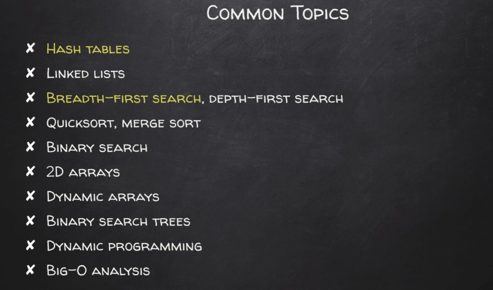
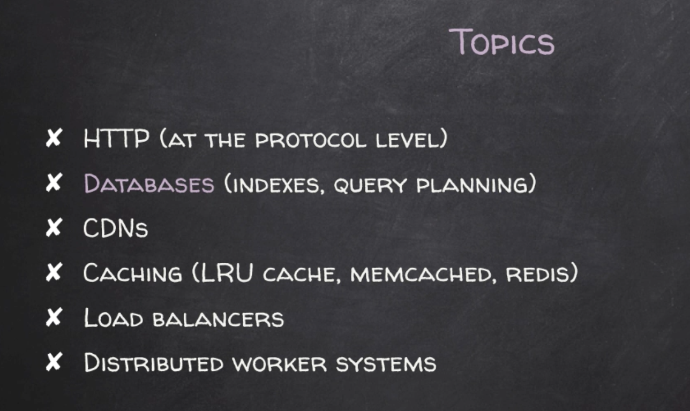

# Interview Prep & Resources

## Common Topics to Know



A lot of these problems can be solved with Breadth-First Search and Hash Tables (hence why they are highlighted). You should also know how to write a BFS from scratch.

### Common System Design Topics



- Spend some time asking questions about the scope of the requirements of the system
- [GitHub System Design Resource](https://github.com/checkcheckzz/system-design-interview) — contains everything you need to learn how to answer these questions
- [Blog with Specific Questions](http://blog.gainlo.co/index.php/category/system-design-interview-questions/) — how to build a key value store, garbage collector, web crawler, etc.

A better approach to system design interviews is reading up on books like [Alex Yu's System Design Interview](../System%20Design%20Books/Alex%20Yu%20-%20System%20Design%20Interview%20An%20Insiders%20Guide%20by%20Alex%20Yu%20z-liborg.pdf) or [Grokking the Advanced System Design Interview](../System%20Design%20Books/Grokking%20the%20Advanced%20System%20Design%20Interview.pdf). Key areas to study:
- Back-of-the-envelope estimations
- Common system architectures (news feeds, Google Drive, "design YouTube", URL shortener, etc.)
- Components: load balancers, CDNs, caching, DB master-slave replication

## Interview Tips & Links

[Top 8 Common Mistakes and Why](https://blog.pramp.com/top-8-mistakes-in-technical-interviews-according-to-data-27d2572bda1f)

[How to Get Unstuck During a Technical Interview](https://blog.pramp.com/how-to-get-unstuck-in-technical-interviews-93d4632ef996)

[Guide to Take-Home Challenges](https://www.freecodecamp.org/news/the-essential-guide-to-take-home-coding-challenges-a0e746220dd7)

[Need Some Coding Projects to Learn](https://www.google.com/search?q=ideas+for+programming+projects&oq=ideas+for+program&aqs=chrome.0.0j69i57j0l4.5016j0j7&sourceid=chrome&ie=UTF-8) (from coding bootcamps)

[Reddit Guide for Course Work Resources](https://www.reddit.com/r/learnprogramming/comments/ortnef/a_super_harsh_guide_to_learning_computer_science/)

## Database Design Basics

Information on required skills for [Database Design](https://vertabelo.com/blog/database-designer-skills/) (really comes down to relational databases):
- Understanding how tables are composed of rows (or tuples)
- Each table (or relation) is defined by its attributes (or columns)
- All relations should have one or more outstanding attributes that represent a unique identifier for each tuple — this is the key of the table
- Non-key attributes are key-dependent in the sense that each key determines a single possible value for each attribute

## Practice Problems

### Allscripts Interview Question

Given a list of n integers, combine the lists and return one full sorted list at the end. The interviewer specified he was looking for a solution using a data structure.

This solution uses a priority queue to push the elements from each list of list integers. Then once we create the queue (which is unsorted as an array), we remove from it and add to an array to get it sorted. When converting the queue to an array the elements are in no particular order — so adding to the array one element at a time is how we return a sorted list.

([StackOverflow explanation](https://stackoverflow.com/questions/20923615/sorting-integers-by-a-priority-queue))

Note: this solution can be better since it's O(n² + n).

```
package com.practice;

import java.util.ArrayList;
import java.util.Arrays;
import java.util.List;
import java.util.PriorityQueue;

public class Main {
    // We pass to this method the following values for each list
    list1 = [2, 5, 6, 8, 12]
    list2 = [7, 8, 13, 14, 19, 20, 26, 30]
    list3 = [1, 2, 3, 14]
    listoflists = [list1, list2, list3]

    public static List<Integer> mergeSortedLists(List<List<Integer>> listoflists) {
        List<Integer> combinedList = new ArrayList();

        // Loop through each list
        // For each list get the inner lists ints and push to the priority queue
        // Run a while loop until queue is empty and pop to combinedList

        PriorityQueue<Integer> queue = new PriorityQueue<>();


        for(int i=0; i<listoflists.size(); i++) {
            List<Integer> inputList = new ArrayList<>();
            inputList = listoflists.get(i);
            int count = 0;
            while(count != inputList.size()) {
                int inputVal = inputList.get(count);
                queue.add(inputVal);
                count++;
            }
        }

        Integer[] arr = new Integer[queue.size()];
        for (int i = 0; i < arr.length; i++) {
            arr[i] = queue.remove();
        }


        combinedList = Arrays.asList(arr);
        System.out.println(combinedList.toString());

        return combinedList;
    }
}
```

## Framework-Specific Topics

### Vue.js

**1. Difference between slots and scoped slots?**

A slot is a placeholder in a child component that is filled with content passed from the parent. Content of a regular slot is compiled in the parent scope then passed to the child component.

This means you can't use child component properties in a slot's content. But scoped slots allow you to pass child component data to the parent scope and then use that data in slot content.

**2. Vue.js reactivity and common issues when tracking changes**

Properties are reactive — if they change, the components will automatically update and re-render as needed. All properties are converted to getter and setter during initialization, letting Vue detect when those properties are accessed or changed.

Problems that occur:
- Vue can't detect object property addition or deletion due to a JS limitation. Use `Vue.set` and `Vue.delete` to get around this.
- Similarly Vue cannot detect array item modifications using an index — use `Vue.set`.

### Spring Framework

**What is dependency injection?**
- Spring container "injects" objects into other objects or "dependencies"
- Ensures loose coupling between classes
    - **Loose Coupling:** Classes are independent of each other. The only knowledge between two classes is what the other class has exposed through its interfaces.
- Responsible for injecting dependencies through either Constructor or Setter methods
- **IOC (Inversion of Control):** Emphasizes keeping Java classes independent of each other and the container frees them from object creation and maintenance
- Example: driving your car to work = tight coupling. Having a cab take you to work = loose coupling (changing control to the cab driver)

**Tight Coupling:**
```
public class A
{
    B b;

    public A()
    {
        b = new B();
    }

    public void Task1() {
        // do something here..
        b.SomeMethod();
        // do something here..
    }

}

public class B {

    public void SomeMethod() { 
        //doing something..
    }
}
```

**After Inversion of Control:**
```
public class A
{
    B b;

    public A()
    {
        b = Factory.GetObjectOfB ();
    }

    public void Task1() {
        // do something here..
        b.SomeMethod();
        // do something here..
    }
}

public class Factory
{
    public static B GetObjectOfB() 
    {
        return new B();
    }
}
```

**What is loose coupling?**
Imagine you have created two classes, A and B, in your program. Class A is called volume, and class B evaluates the volume of a cylinder. If you change class A, you are not forced to change class B — this is loose coupling. When class A requires changes in class B, then you have tight coupling.

## Additional Resources

- [Interview Udemy Courses](../Interview%20Udemy%20Courses/) — Personal pitch documentation, interview checklists, thank you templates
- [System Design Books](../System%20Design%20Books/) — 10 books on system design and distributed systems
- [Amazon OA Prep](../Amazon%20OA/) — Assessment questions and coding attempts
- [Helpful Documentation](../Helpful%20Documentation/) — NeetCode 75 question spreadsheet

---

[← Back to Index](index.md)
