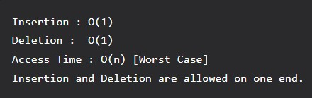

# Stacks

A stack or LIFO (last in, first out) is an abstract data type that serves as a collection of elements, with two principal operations: push, which adds an element to the collection, and pop, which removes the last element that was added. In a stack both the operations of push and pop take place at the same end — the top of the stack. It can be implemented using both array and linked list.



## Use Cases

- Maintaining function calls (the last called function must finish execution first)
- Removing recursion with the help of stacks
- Reversing a word
- Checking for balanced parenthesis
- Undo operation in editors (the word you typed last is the first to be removed)
- Back functionality in web browsers

## Implementation (Java)

```
// Main Class aka driver

package com.practice;

public class Main {

    public static void main(String[] args) {
        Stack stack = new Stack(5);

        stack.push(1);
        stack.push(2);
        stack.push(3);

        stack.pop();
        stack.push(4);

        stack.print();
    }
}
```

```
// Actual Stack Class

package com.practice;

public class Stack {
    private static int arr[];
    private static int capacity;
    private static int top;

    Stack(int size) {
        arr = new int[size];
        capacity = size;
        top = -1;
    }

    public static void push(int x) {
        if(isFull()) {
            System.out.println("Stack Overflow Error");
        }

        top++;
        arr[top] = x;
    }

    public static void pop() {
        if(isEmpty()) {
            System.out.println("Stack Underflow Error");
        }

        arr[top] = 0;
        top--;
    }

    public static int peep() {
        if(isEmpty()) {
            System.out.println("Stack is empty");
        }

        return arr[top];
    }

    public static void print() {
        if(isEmpty()) {
            System.out.println("Stack is empty");
            return;
        }

       for (int n : arr) {
           System.out.print(n + " ");
       }
    }

    public static boolean isFull() {
        return top == capacity - 1;
    }

    public static boolean isEmpty() {
        return top == -1;
    }
}
```

## Additional Operations

Other possibilities with Stacks are: `empty()` and `search(Object element)`. We can also use a Vector as such:
```
public class Stack<E> extends Vector<E>
```

---

[← Back to Index](index.md) | [Next: Queues →](09-queues.md)
