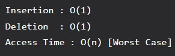

# Queues

A queue or FIFO (first in, first out) is an abstract data type that serves as a collection of elements, with two principal operations: enqueue, the process of adding an element to the collection (the element is added from the rear side), and dequeue, the process of removing the first element that was added (the element is removed from the front side). It can be implemented using both array and linked list.



## Use Cases

Any situation where resources are shared among multiple users and served on a first come first serve basis:
- CPU scheduling
- Disk scheduling
- IO Buffers, pipes, file IO
- Data transferred asynchronously between two processes (data not necessarily received at the same rate as sent)

## Circular Queue

The advantage of this data structure is that it reduces wastage of space in case of array implementation, as the insertion of the (n+1)th element is done at the 0th index if it is empty.

## Implementation (Java)

```
// Main Class aka Driver

public class Main {

    public static void main(String[] args) {
        Queue queue = new Queue(5);

        queue.enqueue(1);
        queue.enqueue(2);
        queue.enqueue(3);
        queue.enqueue(4);
        queue.enqueue(5);

        queue.dequeue();
        queue.first();

        queue.print();
    }
}
```

```
// Queue Java Class

public class Queue {
    private static int queue[];
    private static int front, rear, capacity;

    Queue(int size) {
        front = rear = 0;
        capacity = size;
        queue = new int[capacity];
    }

    public static void enqueue(int data) {
        if(capacity == rear) {
            System.out.println("Queue is full");
            return;
        }

        queue[rear] = data;
        rear++;
    }

    public static void dequeue() {
        if(front == rear) {
            System.out.println("Queue is empty");
            return;
        }

        else {
            for (int i = 0; i < rear - 1; i++) {
                queue[i] = queue[i + 1];
            }

            if (rear < capacity) {
                queue[rear] = 0;
            }
            rear--;
        }

        return;
    }

    public static void first() {
        if(front == rear) {
            System.out.println("Queue is empty");
            return;
        }

        System.out.print("This is the first element in queue: " + queue[front]);
    }

    public static void print() {
        if(front == rear) {
            System.out.println("Queue is full");
            return;
        }

        System.out.println("Printing out the queue");
        for(int i=front; i<rear; i++) {
            System.out.print(queue[i]);
        }
    }
    
}
```

## Priority Queue

A priority queue is a queue in which every element has a priority determining the order in which it is dequeued. If two elements have the same priority they are served according to their order in the queue.

### Types of Priority Queues

**1. Ascending Order:** The element with a lower priority value is given a higher priority. For example, in a priority queue arranged as 4, 6, 8, 9, 10 — 4 has the highest priority.

**2. Descending Order:** The root node is the maximum element in a max heap. It removes the element with the highest priority first. The root node is removed from the queue, and the heap invariant is maintained by comparing the newly inserted element to all other entries.

### Basic Usage

```
public static void main(String args[])
{
    PriorityQueue<String> pq = new PriorityQueue<>();

    pq.add("Geeks");
    pq.add("For");
    pq.add("Geeks");

    System.out.println(pq);
}

Output: [For, Geeks, Geeks]
```

Note: when implementing Priority Queue it is ascending by default. We can change this by creating a custom comparator.

### Custom Comparator (Descending Order)

```
static class CustomIntegerComparator implements Comparator<Integer> {

    @Override
    public int compare(Integer o1, Integer o2) {
        return o1 < o2 ? 1 : -1;
    }
}
```

```
testIntegersPQ.add(11);
    testIntegersPQ.add(5);
    testIntegersPQ.add(-1);
    testIntegersPQ.add(12);
    testIntegersPQ.add(6);

    System.out.println("Integers stored in reverse order of priority in a Priority Queue\n");
    while (!testIntegersPQ.isEmpty()) {
        System.out.println(testIntegersPQ.poll());
    }

Output: 12 6 5 -1
```

---

[← Back to Index](index.md) | [Prev: Stacks](08-stacks.md) | [Next: Binary Trees →](10-binary-trees.md)
