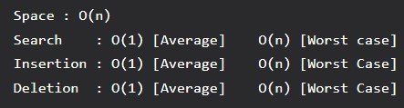

# Hashing

## Hash Function

A function that converts a given big input key to a small practical integer value. The mapped integer value is used as an index in the hash table. A good hash function should have the following properties:
1. Efficiently computable.
2. Should uniformly distribute the keys (each table position equally likely for each key).

## Hash Table

An array that stores pointers to records corresponding to a given phone number. An entry in a hash table is NIL if no existing phone number has a hash function value equal to the index for the entry.

## Collision Handling

Since a hash function gets us a small number for a key which is a big integer or string, there is the possibility that two keys result in the same value. The situation where a newly inserted key maps to an already occupied slot in the hash table is called collision and must be handled using some collision handling technique.

**Chaining:** The idea is to make each cell of the hash table point to a linked list of records that have the same hash function value. Chaining is simple but requires additional memory outside the table.

**Open Addressing:** In open addressing, all elements are stored in the hash table itself. Each table entry contains either a record or NIL. When searching for an element, we examine table slots one by one until the desired element is found or it is clear that the element is not in the table.

## Hashing vs BST

Hashing seems better than BST for all the operations. But in hashing, elements are unordered and in BST elements are stored in an ordered manner. Also, BST is easy to implement but hash functions can sometimes be very complex to generate. In BST, we can also efficiently find floor and ceil of values.

## Use Cases

- Remove duplicates from a set of elements
- Find the frequency of all items
- Check visited URLs in web browsers
- Detect spam in firewalls (hash IP addresses)
- Any situation where you want search(), insert(), and delete() in O(1) time

---

[← Back to Index](index.md)
